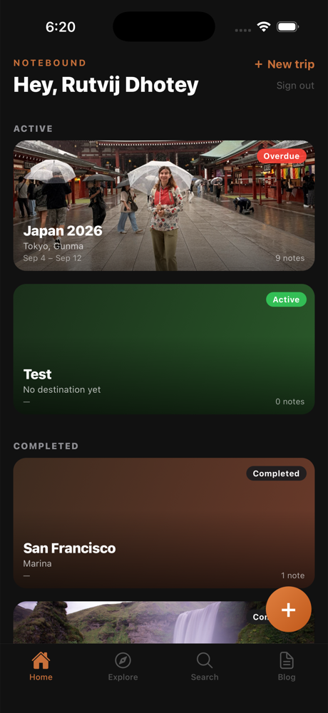
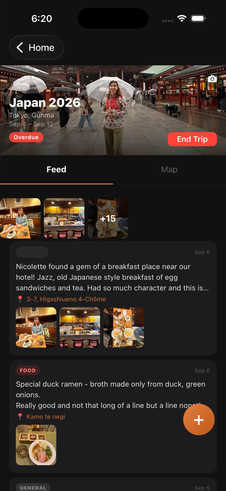
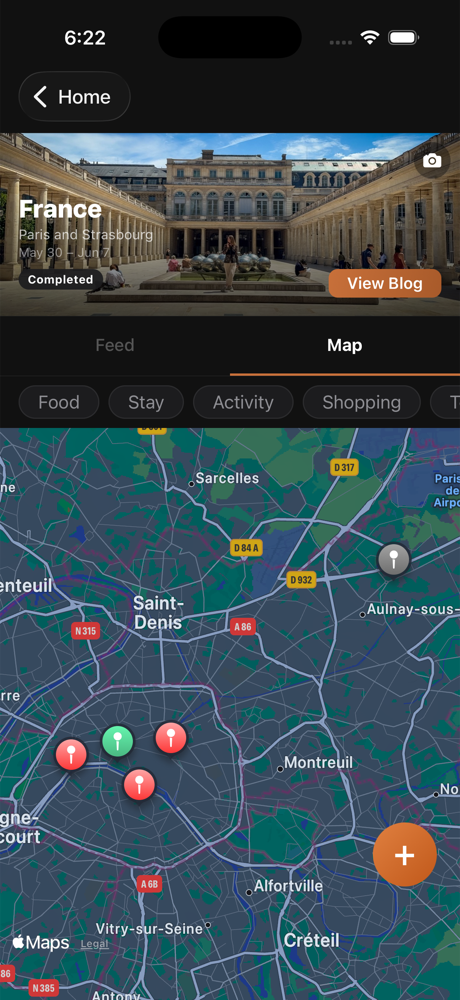
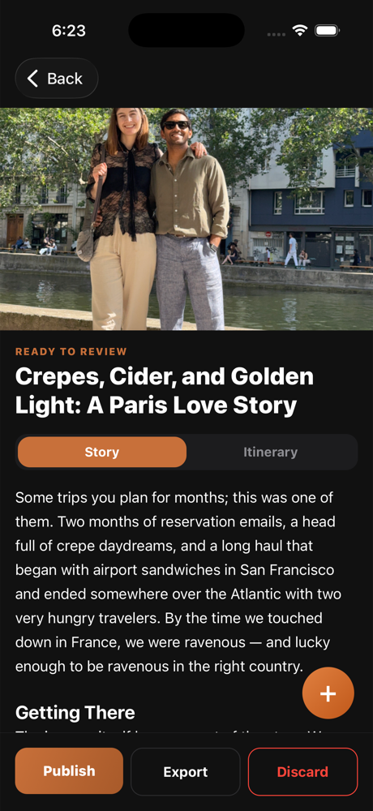
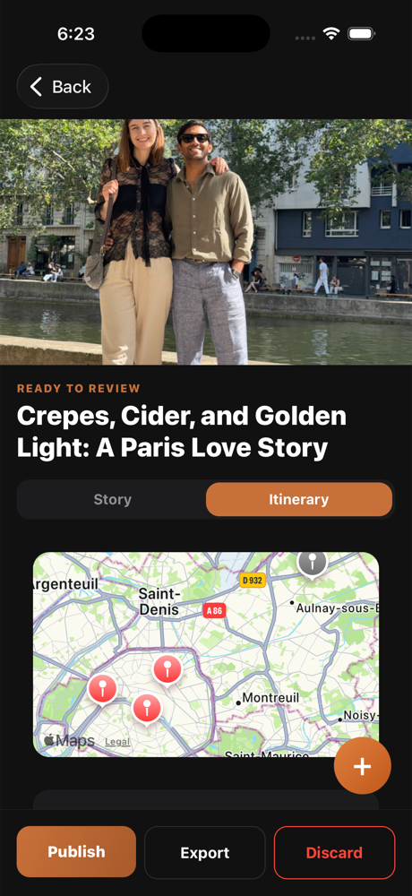
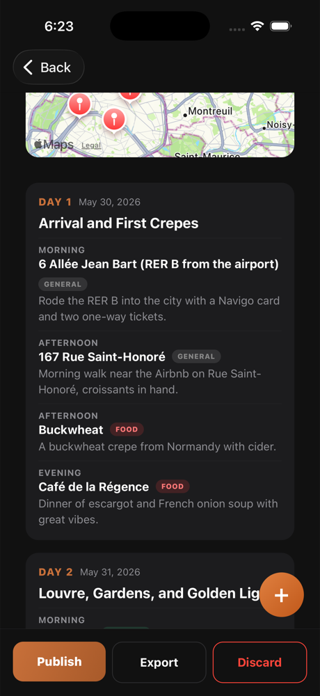
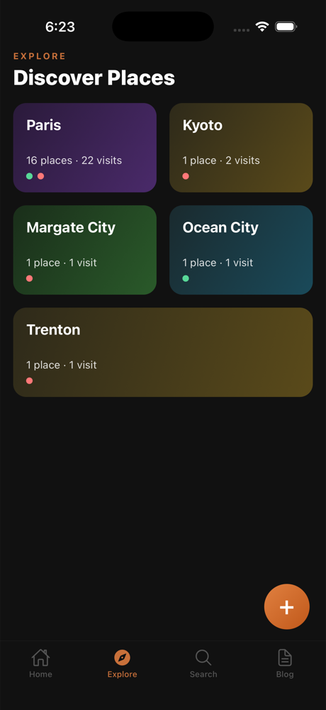
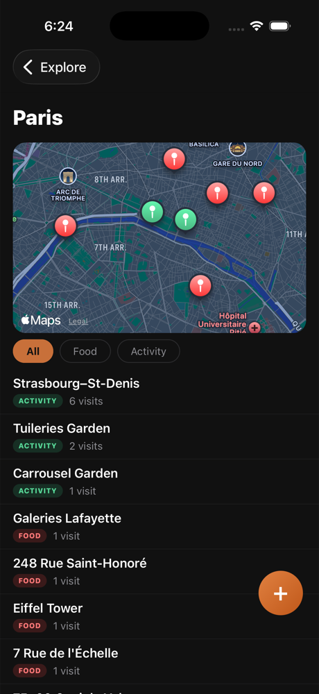

# Notebound

**An offline-first travel journal that turns raw notes into a written trip.**

You start a trip and capture notes as you go: a typed line, a spoken thought, a few photos. When the trip ends, Claude writes it up as a blog post with a day-by-day itinerary, choosing the photos it judges strongest. Nothing you capture is ever lost to a bad connection.

Notebound is a React Native app for iOS, backed entirely by a single Supabase project and the Anthropic API. There is no server of our own to run.

---

## What it does

- **Capture without friction.** Type, dictate (on-device speech recognition), or attach up to three photos per note. Saving never waits on the network.
- **Works offline.** Notes and photos are written to a local queue first and sync when a connection returns, on reconnect, on foreground, or on next launch.
- **Knows where you were.** Location comes from GPS, photo EXIF, or a manual edit. GPS fixes that land implausibly far from the trip (over 200 km from any anchor) are corrected to the trip's own anchor city.
- **Tags notes automatically.** Claude Haiku classifies each note (food, stay, activity, shopping, to-visit, general) and resolves a place name in the background.
- **Writes the trip up.** Once a trip is complete, Claude Opus (with vision) reads your notes and photos and produces a blog post, plus a day-by-day itinerary with a map when the trip spans enough located days.
- **Shares on your terms.** Export a post as Markdown or HTML from the share sheet.
- **Explore.** After a trip completes, anonymized place data (name, city, category, rating) feeds a community map you can browse by destination. Journals, photos, and anything private stay private.

## Screenshots

<table>
  <tr>
    <td align="center"><br><sub><b>Your trips</b></sub></td>
    <td align="center"><br><sub><b>Capture feed</b></sub></td>
    <td align="center"><br><sub><b>Trip map</b></sub></td>
  </tr>
  <tr>
    <td align="center"><br><sub><b>Generated story</b></sub></td>
    <td align="center"><br><sub><b>Itinerary map</b></sub></td>
    <td align="center"><br><sub><b>Day by day</b></sub></td>
  </tr>
  <tr>
    <td align="center"><br><sub><b>Explore</b></sub></td>
    <td align="center"><br><sub><b>Destination</b></sub></td>
    <td></td>
  </tr>
</table>

## Architecture in brief

Three boxes: the **device**, one **Supabase project** (Auth, Postgres with RLS, Realtime, Storage, Edge Functions, pg_cron), and the **Anthropic API**.

| Decision | Why |
|---|---|
| Local queue first, sync second | A note taken on a mountain pass with no signal can't be re-taken. Capture must never block on the network. |
| Supabase as the whole backend | One developer, no ops. Authorization lives in the database (RLS), so there is no application tier that can forget to check ownership. |
| Edge functions hold every secret | The client holds only the anon key. Anthropic and service-role keys never leave the server. |
| On-device speech recognition | Free, private, and avoids uploading audio on hotel Wi-Fi. |
| Haiku for tagging, Opus only for the blog | Cost per feature was a design input. The expensive vision pass runs once per trip. |
| Private by default, public by exception | Only an anonymized aggregate ever leaves the owner's boundary, and only after the trip completes. |

The full write-up covers every layer, the reasoning behind it, what each choice costs, how the system fails, and where it is still thin:

**[docs/ARCHITECTURE.html](docs/ARCHITECTURE.html)** (download or open locally; it is a styled HTML document with diagrams).

## Tech stack

- **Client:** React Native 0.81 on Expo SDK 54, React 19, TypeScript (strict), New Architecture enabled, iOS 16.4+
- **Backend:** Supabase (Postgres, Row Level Security, Realtime, Storage, Deno Edge Functions, pg_cron)
- **AI:** Anthropic Claude Haiku 4.5 (tagging, intent) and Opus 4.8 (blog and itinerary, with vision)
- **Maps and location:** Apple Maps via `react-native-maps`, `expo-location`
- **Tests:** Jest with the `jest-expo` preset

## Repository layout

```
src/
  screens/       Home, Explore, Search, Blog tabs; auth, trip, and blog flows
  components/    Note capture and edit sheets, cards, itinerary view and map
  hooks/         Realtime feeds, connectivity, voice, photo picker, location
  services/      The only layer that talks to Supabase; pure helpers sit beside it
  navigation/    Auth/main stack switching and a swipeable pager-based tab bar
  lib/           Supabase client and generated database types
supabase/
  migrations/    SQL source of truth for the schema (apply in order)
  functions/     detect-intent, tag-note, generate-blog (Deno edge functions)
  tests/         SQL-level tests
scripts/         Icon generation, iOS project patching, test-account provisioning
docs/            Architecture paper, progress log, per-feature specs and plans
```

Screens never call Supabase directly. They go through hooks, which go through services.

## Getting started

### Prerequisites

- macOS with Xcode and CocoaPods (the app needs a native build; Expo Go cannot host on-device speech recognition or Apple Maps)
- Node.js and npm
- A Supabase project with the migrations applied, and the three edge functions deployed with an `ANTHROPIC_API_KEY` secret

### Setup

```bash
npm install
```

Create a `.env` file in the project root:

```
EXPO_PUBLIC_SUPABASE_URL=https://<your-project>.supabase.co
EXPO_PUBLIC_SUPABASE_ANON_KEY=<your-anon-key>
```

Only the public anon key belongs here. Never put the service-role or Anthropic keys in the client.

### Run

```bash
npm run ios
```

This installs pods, patches the generated Xcode project, and launches the simulator. Use this rather than `npm start`, since the app depends on native modules.

### Other commands

| Command | Purpose |
|---|---|
| `npm test` | Run the Jest suite |
| `npx tsc --noEmit` | Type-check |
| `npm run prebuild:clean` | Regenerate `ios/` and `android/` from `app.json` (both are gitignored) |
| `npm run icons` | Regenerate app icons from `assets/logo-source.png` |

### Schema changes

Migrations in `supabase/migrations/` are numbered and applied in order. After any schema change, regenerate `src/lib/database.types.ts` and commit it alongside the migration. See [supabase/README.md](supabase/README.md) for the workflow.

## Testing

362 tests across 40 suites. Coverage follows the layering: heavy on pure helpers (merge rules, distance math, ranking, validation), mocked-Supabase tests for services, and render tests for components with real conditional logic. SQL behavior is tested under `supabase/tests/`. There is no end-to-end layer; device QA is manual and recorded in [docs/progress.md](docs/progress.md).

## Operations

A GitHub Actions workflow pings the public `public_places` table every three days. Supabase free-tier projects auto-pause after roughly seven days idle, and a paused project would silently stop a tester's notes from syncing mid-trip. The job uses `curl -f`, so a paused project turns the run red instead of passing quietly.

## Project status

The V1 feature set is complete and the project is moving toward an App Store release. Known gaps are tracked honestly in the architecture paper (section 14) and the progress log. The main release blockers are in-app account deletion, a way for users to opt out of the community map, and a moderation posture for user-generated place names.

V2 candidates: a public blog reader with real web URLs, semantic search, personalized blog voice, an editable blog draft, and hands-free capture.

## Documentation

| Document | What it is |
|---|---|
| [docs/ARCHITECTURE.html](docs/ARCHITECTURE.html) | System design paper: constraints, every layer, failure modes, known gaps |
| [docs/progress.md](docs/progress.md) | Running record of decisions, QA findings, and deferrals |
| [docs/superpowers/specs](docs/superpowers/specs) | Design spec for each feature |
| [docs/superpowers/plans](docs/superpowers/plans) | Implementation plan for each feature |

## Author

Built by [Rutvij Dhotey](https://github.com/rutvijdhotey).
